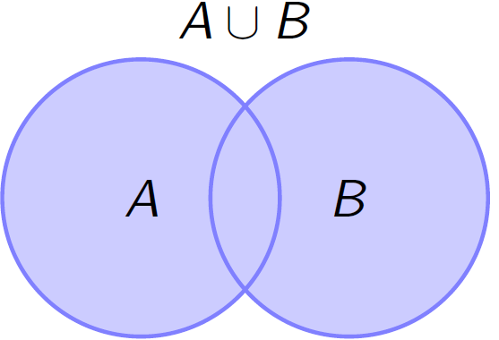
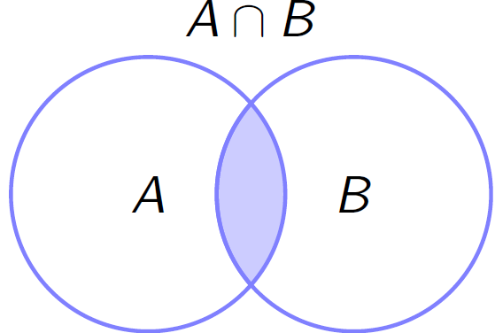
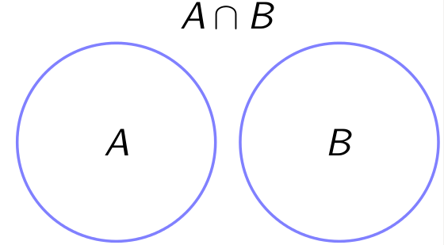
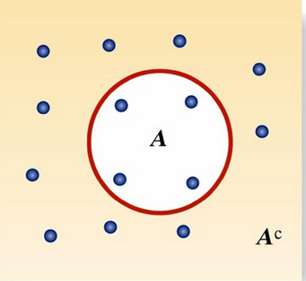

```{r setup, include=FALSE}
library(tufte)
library(knitr, quietly = TRUE)
opts_chunk$set(
               cache = TRUE,
               tidy = FALSE,
               comment = "#",
               collapse = TRUE,
               fig.align = "center",
               fig.path = "figures/",
               cache.path = "cache/"
           )
```

## Introdução

> " A razão do número de todos os casos favoráveis à um
acontecimento, para o de todos os casos possíveis é a
probabilidade buscada, a qual é portanto uma fração ..."
>  
> "A teoria da probabilidade nada mais é do que o senso
comum reduzido à cálculo."
>
> `r tufte::quote_footer('--- Pierre Simon Laplace')`
> `r tufte::quote_footer('--- Ensaio Filosófico Sobre as Probabilidades (1812)')`

A **Teoria da Probabilidade** é o ramo da matemática que 
	desenvolve e pesquisa modelos (probabilísticos) que podem ser utilizados para
	quantificar e explicar os **fenômenos aleatórios**. A Inferência e os métodos estatísticos são totalmente fundamentados nessa teoria e portanto, torna-se essencial o  seu estudo e compreensão. Os modelos probabilísticos utilizados para estudar um **fenômeno aleatório** podem variar em complexidade, mas todos eles possuem ingredientes básicos comuns.

## Tipos Experimentos

### Experimentos Determinísticos

Dizemos que um experimento é determinístico quando repetido inúmeras
vezes, **em condições semelhantes**, conduz a resultados
*essencialmente* idênticos. Ex.:
  
- Aceleração da gravidade;
- Leis da Física e da Química.

### Experimentos Aleatório 

Um experimento aleatório ($\varepsilon$) é aquele que repetido **sob as mesmas condições** pode levar a **resultados diferentes**, isto é, não se pode prever seu resultado. Por Ex:

- Lançamento de uma moeda não-vicida;
- Lançamento de um dado honesto;
- Tempo de falha de um equipamento eletrônico;
- Taxa de inflação do próximo mês.

Exemplos:
	
- $\varepsilon_1$: Lançamento de uma moeda honesta;

- $\varepsilon_2$: Lançamento de um dado honesto;

- $\varepsilon_3$: Lançamento de duas moedas honestas;

- $\varepsilon_4$: Selecionar um morador da cidade de Londrina e medir sua altura;

- $\varepsilon_5$: Observar o tempo de falha de um componente mecânico;

- $\varepsilon_6$: Número peças defeituosas num processo de fabricação


## Espaço Amostral 

O espaço amostral é o **conjunto de todos os resultados possíveis** associados a um experimento (aleatório), repesentado por $\Omega$. Sendo o espaço amostral um conjunto, ele poderá ser **finito ou infinito**.

Dos exemplos anteriores dos experimentos aleatórios, temos:

- $\Omega_{1} = \{c, k\}$, em que $c =$ cara e $k =$ coroa 

- $\Omega_{2} = \{1, 2, 3, 4, 5, 6\}$, em que $i=1,\ldots,6$ são as faces

- $\Omega_{3} = \{(c,c) , (c,k) , (k,c) , (k,k)\}$

- $\Omega_{4} = \{ h \in \mathbb{R},\, h > 0\}$

- $\Omega_{5} = \{ t \in \mathbb{R},\, t > 0\}$

- $\Omega_{6} = \{0, 1, 2, 3, 4,\ldots\}$

## Evento 

Um **evento (aleatório)** é um subconjunto de $\Omega$, ou seja **um conjunto de resultados** de um experimento aleatório. Em geral, os eventos são representados por letras maiúsculas, como $A$, $B$, $C$, $\ldots$ 

Dos exemplos anteriores dos experimentos aleatórios, temos:

- $A:$ sair cara \quad $\Longrightarrow$ \quad $A = \{c\}$;

- $B:$ sair a face $4$ \quad $\Longrightarrow$ \quad $B = \{4\}$;

- $C:$ sair pelo menos uma cara  $\Longrightarrow$ $C = \{(c,c),(c,k),(k,c) \}$;

-  $D = \{ h \in \mathbb{R},\, 0 \leq h \leq 1,70\,\mbox{m}\}$;

-  $E = \{ t \in \mathbb{R},\, 0 \leq t \leq 5\,\mbox{anos}\}$;

-  $F = \{0, 1, 2, 3\}$

## Operações com Eventos

Em muitos problemas de probabilidade interessam-nos eventos que podem ser expressos em termos de dois ou mais eventos, formando **uniões, interseções e complementos**. Os espaços amostrais e os eventos, especialmente as relações entre os eventos, costumam ser ilustrados por  **diagramas de Venn**, que auxiliam na ``visualização'' dos conceitos básicos de probabilidade.

Observa-se que a **Teoria dos conjuntos** é utilizada para definir operações com eventos.

### Definições

- O **evento impossível**, é o conjunto que não possue elementos, denotado por $\emptyset$.

- O **evento certo**, denotado por $\Omega$, é o próprio **espaço amostral**, isto é, $A = \Omega$.

- O **evento Elementar** é aquele que **contém apenas um dos elementos** do espaço amostral.

- Dois eventos $A$ e $B$ são **independentes**, se a ocorrência de um deles **não interfere** na ocorrência do outro evento.

### União de eventos

- o evento que consiste da **união** de todos os elementos
dos eventos que a compõem é denotado por 

$$A \cup B = \{\omega \in \Omega:\, \omega \in A \quad \text{ou} \quad \omega \in B\}.$$

```{r, out.width='35%'}

```

### Intersecção de eventos

- A **intersecção** entre dois eventos é **formada pelos elementos em comuns** dos dois eventos que a compõem, isto é 

$$A \cap B = \{\omega \in \Omega:\, \omega \in A \quad \text{e} \quad \omega \in B\}.$$

```{r, out.width='35%'}

```

### Eventos disjuntos

- Dois eventos $A$ e $B$ são **mutuamente exclusivos** se eles forem **disjuntos**, isto é, $A \cap B = \emptyset$.
   - Exemplo: Lançamento de um dado honesto
      - $A:$ sair o número $2$ $\Longrightarrow$ $A = \{2\}$
      - $B:$ sair o número ímpar $\Longrightarrow$ $B = \{1,3,5\}$
      - Observa-se que os eventos $A$ e $B$ são **mutuamente exclusivos**, ou seja, $A \cap B = \emptyset$.

```{r, out.width='45%'}

```

### Evento complementar

- Seja $A$ um evento tal que $A \subset \Omega$. O **evento complementar** de $A$ ($A^{c}$) é o subconjunto de todos os elementos de $\Omega$ que **não estão em $A$**, isto é

$$A^{c} = \{\omega: \omega \in \Omega \,\, \text{e} \,\, \omega \notin A \}$$

```{r, out.width='30%'}

```


Além disso,


$$A \,\, \text{e} \,\, A^{c} \,\, \text{formam um partição de} \,\, \Omega \implies
    \left\{
    \begin{array}{l}
    A \cup A^{c} = \Omega \\
    A \cap A^{c} = \emptyset
    \end{array}\right.$$


## Exercícios

1. Defina um espaço amostral para cada um dos seguintes experimentos aleatórios:

   a) Uma pessoa concorda ou não com uma afirmação;
   b) Uma moeda honesta é lançada três vezes e observam-se as faces obtidas;
   c) Uma urna contém 10 bolas azuis e 10 vermelhas com dimensões rigorosamente iguais. Três bolas são selecionadas ao acaso com reposição e as cores anotadas;
   d) Lance um dado honesto até que a face 3 ocorra pela primeira vez.


2. Considere o lançamento de um dado honesto e os eventos $A = \{ 1, 2, 3, 4\}$, $B = \{\omega: \omega \leq 3\}$, $C = "\text{face é par}"$, $D = "\text{face é número primo}"$. Determine:

- Uniões

   - A $\cup$ B
   - A $\cup$ C
   - A $\cup$ D
   
- Intesecções

   - A $\cup$ B
   - A $\cup$ C
   - A $\cup$ D
		
- Complementos

   - A$^{c}$
   - B$^{c}$
   - D$^{c}$
   
   
3. Sendo $A$ e $B$ dois eventos em um mesmo espaço amostral, “traduza” para a linguagem da Teoria dos Conjuntos as seguintes situações:

   a) Pelo menos um dos eventos ocorre;
   b) O evento A ocorre, mas B não;
   c) Nenhum deles ocorre.

