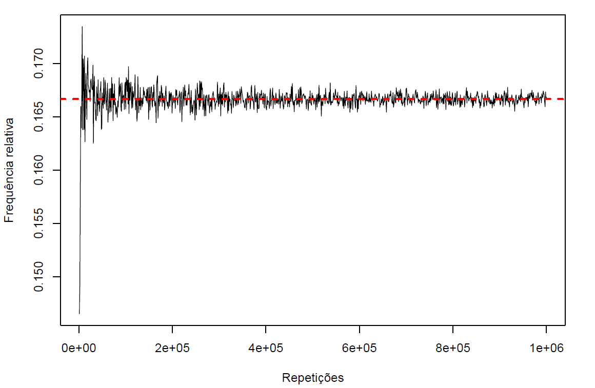
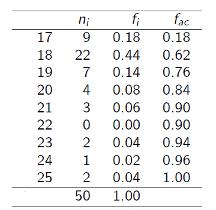
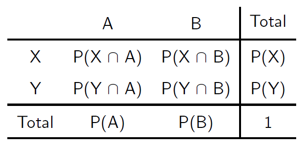
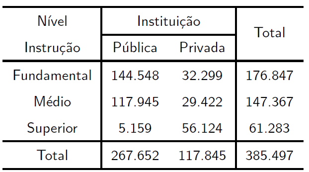
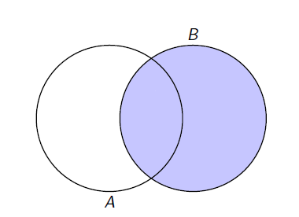
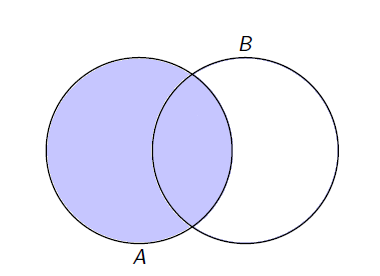
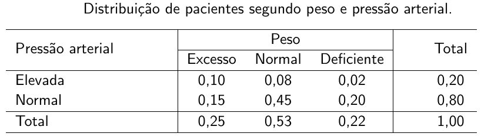
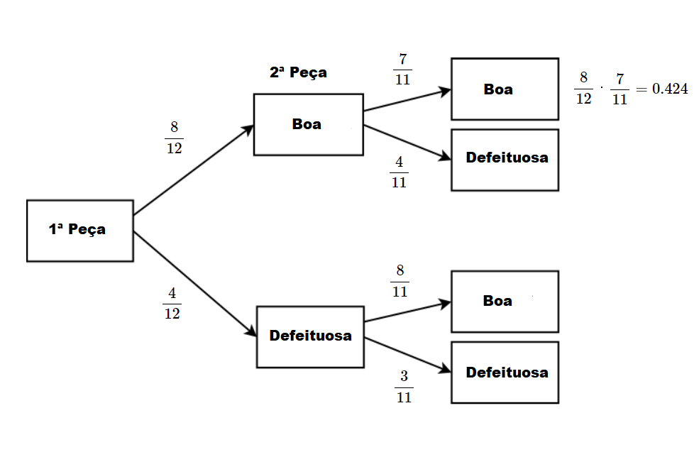
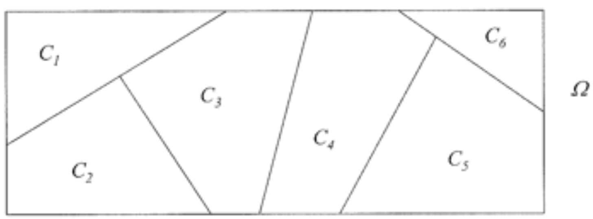
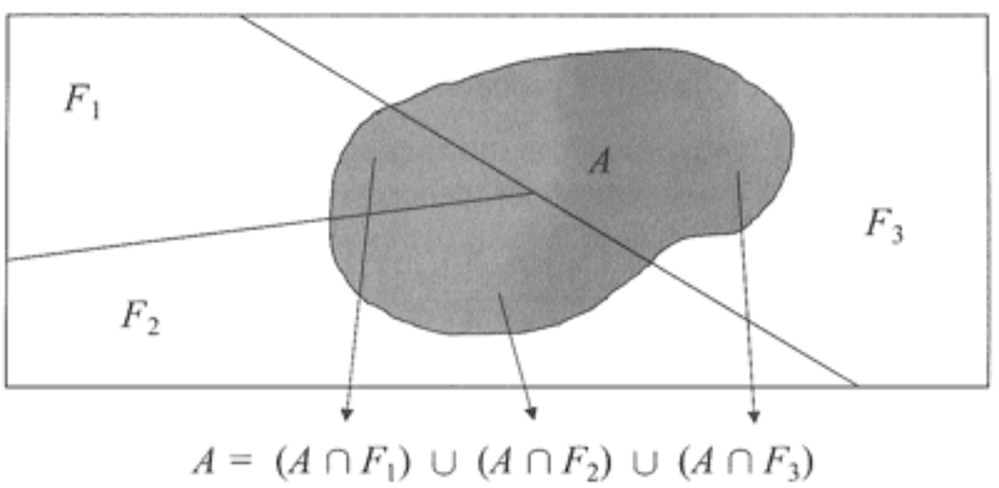

```{r setup, include=FALSE}
library(tufte)
library(xtable)
library(knitr, quietly = TRUE)
opts_chunk$set(
               cache = TRUE,
               tidy = FALSE,
               comment = "#",
               collapse = TRUE,
               fig.align = "center",
               fig.path = "figures/",
               cache.path = "cache/"
           )
```

## Interpretação Clássica

A interpretação clássica de probabilidade levou aproximadamente 150 anos para ser estabelecida. Sua ideia inicial surgiu nas tabernas de jogos da França do século XVII, o que atraiu olhares de matemáticos da época como [Blaise Pascal](https://pt.wikipedia.org/wiki/Blaise_Pascal) e [Pierre de Fermat](https://pt.wikipedia.org/wiki/Pierre_de_Fermat). Baseado nas chances de uma carta de baralho ou numa face de um dado aparecer numa jogada qualquer, o italiano [Girolamo Cardano](https://pt.wikipedia.org/wiki/Girolamo_Cardano) introduziou o conceito de probabilidade, que posteriormente foi fundamentado por [Abraham De Moivre](https://pt.wikipedia.org/wiki/Abraham_de_Moivre) em "Doctrine of Chances" (1718) e por fim, definido matematicamente no **Ensaio Filosófico Sobre as Probabilidades** proposto por [Pierre Laplace](https://pt.wikipedia.org/wiki/Pierre-Simon_Laplace), no início do século XIX. Assim, as principais ideas da interpretação clássica de probabilidade são:

-  A probabilidade é definida com base em dados do **experimento aleatório**.

- A probabilidade é obtida antes de o experimento ser realizado.


$$P(A) = \frac{\text{Número de elementos favoráveis ao evento A}}{\text{Número Total de elementos ($\Omega$)}}$$.

**Observação**: É importante notar que a **definição clássica** exige que os resultados tenham todos **a mesma chance de ocorrer**, ou seja, nesse caso, o espaço amostral é chamado de **equiprovável**.

Exemplos: 

1. Lançamos um dado honesto. Qual é a probabilidade de sair face igual a $4$ ?

   - $\varepsilon =$ Lançar um dado honesto;
   
   - $\Omega = \{1, 2, 3, 4, 5, 6\}$;
   
   - $A = \{4\}$

Portanto, $$P(A) = \frac{1}{6}.$$

2. Lançamos um dado honesto. Qual é a probabilidade de sair face maior ou igual a $3$?

   - $\varepsilon =$ Lançar um dado honesto;
   
   - $\Omega = \{1, 2, 3, 4, 5, 6\}$;
   
   - $A = \{3, 4, 5, 6\}$
   
Portanto, $$P(A) = \frac{2}{3}.$$

3. Lançamos uma moeda não-viciada duas vezes. Se $c =$ cara e $k =$ coroa, então qual é a probabilidade de obtermos faces iguais nos dois lançamentos?    

   - $\varepsilon =$ uma moeda não-viciada duas vezes;
   
   - $\Omega = \{(c,c), (c,k), (k,c), (k,k)\}$;
   
   - $A = \{(c,c), (k,k)\}$

Portanto, $$P(A) = \frac{1}{2}.$$

**Pergunta:** Com base no resultado do exemplo 1, podemos afirmar que a cada 6 lançamentos de um dado honesto, uma face será sempre 4?

**Não,** pois cada lançamento é **aleatório**! No entanto, se repetíssemos o lançamento de um dado inúmeras vezes, **a proporção de vezes em que ocorre o 4** seria aproximadamente 0,1667 $\implies$ **frequência relativa**.

Além disso, Como calcular as probabilidades (na interpretação clássica) nas seguintes situações:

- Uma pessoa que fuma um pacote de cigarros por dia desenvolver câncer.

- Ocorrer uma geada no próximo inverno no sul do Brasil.

- Acidente automobilístico em Londrina, nos finais de semana, no período
		entre 0h e 4h da manhã.

## Interpretação Frequentista

A interpretação frequentista (ou estatística) de probabilidade foi proposta para tentar superar as **inconsistência da definição clássica**, pois a maior parte dos problemas práticos, a **suposição de equiprobabilidade** (os resultados do espaço amostral possue a mesma chance de ocorrência) não é satisfeita.

Assim, uma das primeiras abordagens da interpretação frequentista de probabilidade deve-se ao matemático inglês [John Venn](https://pt.wikipedia.org/wiki/John_Venn), que em 1866  formalizou a ideia de **exprimir probabilidades** em termos do **limite de frequências relativas** das sequências de repetições independentes em condições similares.

Neste sentido, pode-se pensar então em **repetir o experimento aleatório** $n$ vezes, e observar o número de vezes que o evento $A$ ocorre, $n(A)$ (número de ocorrências de A). Dessa forma a **frequência relativa de $A$** nas $n$ repetições será
	
$$f_A = \frac{ \text{ n(A) }} { \text{ n } }.$$

Observa-se que para $n\rightarrow \infty$ repetições sucessivas e independentes, **a frequência relativa de $A$ tende para uma constante $p$**, isto é,

$$\lim_{n\rightarrow \infty} \frac{ \text{ n(A) }} { \text{ n } } = P(A) = p.$$

Assim, a **definição de probabilidade frequentista** é baseada na repetição de um experimento um grande número de vezes. Ao observar a frequência de uma evento $A$, pode-se obter $P(A)$, isto é,  
	
$$P(A) =  \frac{ \text{ Número de ocorrências de A }} { \text{ Número de repetições}}.$$ 

Ao calcular probabilidades pelo **método da frequência relativa**,
obtém-se uma aproximação em lugar de um valor exato. À medida que o número de observações aumenta ($n \rightarrow \infty$), as aproximações tendem a ficar cada vez mais próximas da probabilidade efetiva. 

Exemplo: Se um dado fosse lançado *10 vezes*, e contássemos quantas
	vezes saiu a face 4, qual seria a probabilidade desse evento?

```{r}
set.seed(6)
n <- 10 ## Tamanho da amostra
x <- numeric(n) ## Objeto para armazenar os resultados
for(i in 1:n){
x[i] <- sample(1:6, size = 1)
}
sum(x == 4) ## Total de valores igual a 4 => n(A)
sum(x == 4)/length(x) ## Proporção de valores igual a 4 => n(A)/n
```

E se fosse para $n = 100$ ?

```{r}
set.seed(6)
n <- 100 ## Tamanho da amostra
x <- numeric(n) ## Objeto para armazenar os resultados
for(i in 1:n){
x[i] <- sample(1:6, size = 1)
}
sum(x == 4) ## Total de valores igual a 4 => n(A)
sum(x == 4)/length(x) ## Proporção de valores igual a 4 => n(A)/n
```

E se fosse para $n = 1000$ ?

```{r}
set.seed(6)
n <- 1000 ## Tamanho da amostra
x <- numeric(n) ## Objeto para armazenar os resultados
for(i in 1:n){
x[i] <- sample(1:6, size = 1)
}
sum(x == 4) ## Total de valores igual a 4 => n(A)
sum(x == 4)/length(x) ## Proporção de valores igual a 4 => n(A)/n
```


E se fosse para $n = 10000$ ?

```{r}
set.seed(6)
n <- 10000 ## Tamanho da amostra
x <- numeric(n) ## Objeto para armazenar os resultados
for(i in 1:n){
x[i] <- sample(1:6, size = 1)
}
sum(x == 4) ## Total de valores igual a 4 => n(A)
sum(x == 4)/length(x) ## Proporção de valores igual a 4 => n(A)/n
```

E se fosse para $n = 1000000$ ?

```{r}
set.seed(6)
n <- 1000000 ## Tamanho da amostra
x <- numeric(n) ## Objeto para armazenar os resultados
for(i in 1:n){
x[i] <- sample(1:6, size = 1)
}
sum(x == 4) ## Total de valores igual a 4 => n(A)
sum(x == 4)/length(x) ## Proporção de valores igual a 4 => n(A)/n
```

Graficamente, temos que
```{r, echo=FALSE, out.width='90%'}

```

Assim, 

$$\lim_{n\rightarrow \infty} \frac{\text{ n(A) }} { \text{ n } } = P(A) \thickapprox 0,1667.$$
	
As probabilidades calculadas a partir de frequências relativas, são
**estimativas** da verdadeira probabilidade. Observa-se que a **Lei dos Grandes Números** nos diz que as **estimativas** dadas pelas **frequências relativas** tendem a ficar razoáveis com mais observações.

Exemplos:

1. Imagine que um pesquisador tenha interesse em avaliar a idade dos alunos que estão cursando a disciplina de probabilidade na UEL. Para isso, vamos considerar um total de 50 alunos numa sala de aula. A Tabela de frequências abaixo, mostra o número de alunos por idade.

```{r, echo=FALSE, out.width='40%'}

```

Um aluno é selecionado ao acaso. Qual é a probabilidade do

   a) Aluno ter 17 anos?
   b) Aluno ter no máximo 23 anos ?


**Solução:**
   
   a) Observa-se que $\Omega = \{1, 2, \ldots, 50\}$ alunos. 
   
Vamos definir o evento $A$: "Alunos que tenham a idade igual a 17 anos".
   
Logo, 

$$P(A) = \frac{ \text{ Número de alunos que possui 17 anos }} { \text{ Número total de alunos } } = \frac{9}{50} = 0,18.$$
   
b) Vamos definir o evento $B$: "Alunos que tenham no máximo 23 anos".

Observa-se que o evento $B$ são os alunos que possuem idade até 23 anos, isto é, 17, 18,$\ldots$, 23 anos.
   
Logo, 

$$P(B) = \frac{ \text{ Número de alunos que possuem até 23 anos }} { \text{ Número total de alunos } } = \frac{47}{50} = 0,94.$$

## Interpretação Subjetiva 

Apesar da interpretação frequentista ter sido adotada de
forma quase unâmime pelos estatísticos durante a primeira metade do século XX, ela **sofreu duras críticas** pela falta de suporte empírico da complexa **noção de independência**. Além disso, **muitos experimentos não podem ser repetidos**, como por exemplo, qual a taxa de inflação do próximo mês?, e assim, é impossível dar uma interpretação frequentista a essa questão. Nesse sentido, uma outra interpretação possível é a **interpretação subjetiva**, na qual ao invés de pensar em probabilidade como uma frequência, pode-se pensá-la como uma **crença** na chance do evento ocorrer. Por exemplo, "Qual é probabilidade de chover amanhã ?" Observa-se que esse evento, não poderá ser realizado um número grande de vezes.

## Axiomas de Kolmogorov

No início do século XX, muitos matemáticos sentiram a necessidade de uma **formalização axiomática**, que permitisse **eliminar as ambiguidades e inconsistências**, dos conceitos de probabilidade por meio da construção de uma teoria matemática. Influenciados pelo movimento de formalização das teorias da matemática após a crise dos [fundamentos da matemática](https://pt.wikipedia.org/wiki/Fundamentos_da_matem%C3%A1tica#Surgimento_de_Paradoxos) no final do século XIX, o matemático russo [Andrei Kolmogorov](https://pt.wikipedia.org/wiki/Andrei_Kolmogorov) apresentou um **conjuntos de axiomas** para **definir probabilidade como uma função** do espaço amostral que assume valores nos números reais.

Considera-se uma função $P(\cdot)$, que **associa valores numéricos à um evento $A$ do espaço amostral**, $\Omega$, a probabilidade do evento $A$,  desde que $P(\cdot)$ satisfaz os **axiomas de Kolmogorov**:

A1. $P(\Omega) = 1$;

A2. $0 \leq P(A) \leq 1$;

A3. Se $A$ e $B$ são eventos mutuamente exclusivos, então
	
$$P(A \cup B) = P(A) + P(B).$$

Observa-se que o **axioma A3** pode ser generalizado para $n$ eventos. 

A3$^{\prime}.$ Sejam $A_1, A_2,\ldots,A_n$ **eventos disjuntos 2 a 2** para $i = 1, 2,\ldots,n.$. Então, 

$$P\left(\bigcup_{i=1}^{n} A_{i}\right) = \sum_{i=1}^{n} P(A_{i}),$$

### Propriedades de Probabilidade 

P1. $P(\emptyset) = 0$;

P2. $P(A^{c}) = 1 - P(A)$ em que $A^{c}$ é o evento complementar de $A$.

P3. Sejam $A$ e $B$ eventos de $\Omega$. Se $A \subset B$ então $P(A) \leq P(B)$.

P4. Sejam $A$ e $B$ eventos quaisquer de $\Omega$. Então, 

$$P(A \cup B) = P(A) + P(B) - P(A \cap B)$$

### Tabela de Probabilidades Conjuntas e Marginais

Quando dois ou mais eventos de $\Omega$ estão envolvidos, pode-se construir uma tabela de probabilidades, isto é,

```{r, echo=FALSE, out.width='50%'}

```

- **Probabilidades Marginais**: São as probabilidades individuais
	nas margens da tabela.
	
- **Probabilidades Conjuntas**: São as probabilidades de ocorrência
	de dois (ou mais) eventos simultâneos.

### Exercícios

**1**. \ Considere o experimento aleatório: Lançamento de dois dados honestos.

a) \ Determine o espaço amostral.

b) \ Considere o evento $X$: \ Soma das faces que aparecem nos dois lançamentos. 

Calcular: 

$P(X > 10)$; \ $P(X \ \text{é par})$; \ $P(X \ \text{é par} \ \ \cap X > 10)$; \ $P(X \ \text{é par} \ \cup \ X > 10)$ \ e \ $P(X \leq 10)$.

**2**. \ Uma escola oferece três cursos optativos de idiomas: espanhol, francês e alemão. As turmas são abertas a qualquer um dos 100 alunos matriculados. Há 28 estudantes na turma de espanhol, 26 na turma de francês e 16 na turma de alemão. Há 12 alunos cursando espanhol e francês, 4 fazendo espanhol e alemão, e 6 cursando francês e alemão. Além disso, 2 estudantes acompanham os três cursos.

a) \ Se um aluno é selecionado ao acaso, qual a probabilidade de que ele não acompanhe nenhum dos três cursos?

b) \ Se um estudante é selecionado aleatoriamente, qual a probabilidade de que esteja fazendo exatamente um dos cursos?

**3**. \ A Tabela a seguir apresenta a distribuição de alunos diplomados, segundo nível de ensino e tipo de instituição, no município de São Paulo.

```{r, echo=FALSE, out.width='50%'}

```

Um aluno diplomado em 2002 no município de São Paulo é selecionado ao acaso. 

Pergunta-se:

a) \ Qual é a probabilidade do aluno escolhido ter se formado no ensino médio e numa instituição pública?

b) \ Qual é a probabilidade do aluno ter se formado no ensino médio ou numa instituição pública?

c) \ Qual é a probabilidade do aluno ser formado no ensino médio sabendo-se que é de instiuição pública?

## Probabilidade Condicional

Em muitos casos, o fenômeno aleatório com o qual tem-se interesse, pode ser estudado em etapas, isto é, a **informação do que ocorreu** em uma determinada etapa **pode influenciar** nas probabilidades de ocorrências das etapas sucessivas. Nestes casos, pode-se dizer que **obtemos informação**, e assim calcula-se as probabilidades de interesse a partir dessa informação. Estas probabilidades recalculadas recebem o nome de **probabilidades condicionais**.

Para entender a ideia de probabilidade condicional, considere o seguinte exemplo:

Para entender a ideia de probabilidade condicional, considere o
	seguinte exemplo:
	
- Um dado honesto foi lançado, qual é a probabilidade de ter ocorrido face 4?
 
- Suponha que o dado foi jogado, e, sem saber o resultado, você recebe a informação de que ocorreu face par. Qual é a probabilidade de ter saido face 4 com essa "nova" informação?
		
**Solução**

Observa-se que  $\Omega = \{1,2,3,4,5,6\}$ 

$A$: \ face 4 = $\{4\}$ $\implies$ $P(A) = \frac{1}{6}$
			
$B$: \ face par = $\{2,4,6\}$ $\implies$ $P(B) = \frac{3}{6}$	

$C$: \ face 4, dado que ocorreu face par = $\{4\}$ $\implies$ $P(C) = \frac{1}{3}$


**Ideia central de probabilidades condicionais**

Dado que B tenha ocorrido, o espaço amostral ficou **reduzido** para B,
pois todos os resultados possíveis passam a ser aqueles do evento B.

### Definição

A probabilidade do evento $A$, dado que o evento $B$ ocorreu, é chamada **probabilidade condicional de A dado B**, denota-se por $P(A|B)$. 
	    	
Assim,
	    
$$P(A|B) = \frac{P(A \cap B)}{P(B)}.$$
	 
Pelo **diagrama de Venn**, temos

```{r, echo=FALSE, out.width='50%'}

```
	    
Da mesma forma **a probabilidade de B ocorrer, dado que A ocorreu** é definida como
	    	
$$P(B|A) = \displaystyle \frac{P(A \cap B)}{P(A)}.$$

Pelo **diagrama de Venn**, observa-se
		
```{r, echo=FALSE, out.width='50%'}

```

**Observações**

- Nota-se, por meio do diagrama de Venn, que a **probabilidade condicional** é apenas **uma redução do espaço amostral**, ao evento que já ocorreu.

- Na probabilidade condicional, **a ocorrência de um evento altera a probabilidade de ocorrência de outro evento**.

**Exemplo:** Um grupo de pacientes foi classificado
quanto a peso e pressão arterial de acordo com as proporções
mostradas na Tabela abaixo.

```{r, echo=FALSE, out.width='70%'}

```

a) \ Considerando-se que um paciente, que é selecionado ao acaso, tem excesso de peso, qual a probabilidade de ter também pressão elevada?

b) \ Sabendo-se que um paciente selecionado ao acaso tem peso deficiente, qual a probabilidade de ter pressão arterial normal?

### Regra da Multiplicação

A regra da multiplicação é uma expressão derivada da definição de probabilidade condicional. Uma vez que

$$P(A|B) =  \frac{P(A \cap B)} {P(B)} \quad \implies
				\quad P(A \cap B) = P(B) \cdot P(A|B),$$
				
ou, ainda,

$$P(B|A) = \frac{P(A \cap B)} {P(A)} \quad \implies
					\quad P(A \cap B) =  P(A) \cdot P(B|A).$$
					
**Observação 1:** \ Com isso pode-se obter a **probabilidade de uma interseção** pelo produto de uma **probabilidade marginal** com uma **probabilidade condicional**.

**Observação 2:** \ A **regra da multiplicação** permite calcular probabilidades em espaços amostrais que são realizados em sequência, em que a ocorrência da segunda etapa **depende** da ocorrência da primeira etapa.

**Exemplo:**

Em um lote de 12 peças, 4 são defeituosas. Duas peças são retiradas aleatoriamente uma após a outra, **sem reposição**. Determine a probabilidade de ambas as peças serem boas?

**Solução 1:**

Experimento aleatório: Retira-se duas peças ao acaso, sem reposição.


Vamos definir os seguintes eventos


$A:$ \ 1$^{a}$ peça selecionada é boa;


$B:$ \ 2$^{a}$ peça selecionada é boa;


$$P(\text{ambas as peças são boas}) = P(A \ \text{e} \ B) = P(A \cap B) = \ ?$$

Observa-se que o evento $B$ \ **(2$^{a}$ peça ser boa) está condicionado ao resultado do evento $A$**, para que ambas as peças não sejam defeituosas.

Assim, pela regra da multiplicação

$$P(A \cap B) = \underbrace{\frac{8}{12}}_{P(A)}\cdot \underbrace{\frac{7}{11}}_{P(B|A)} = 0.424$$

Portanto, a probabilidade de ambas as peças serem boas é 0.424

**Solução 2:**

Experimento aleatório: Retira-se duas peças ao acaso, sem reposição.

Utilza-se a ideia de **árvores (caminhos) de probabilidades**, isto é

```{r, echo=FALSE, out.width='85%'}

```

**Exercício:**

Num lote de 12 peças, 4 são defeituosas. Três peças são retiradas aleatoriamente, uma após a outra, sem reposição. Encontre a probabilidade de: 

a) \ Todas as peças serem defeituosas.

b) \ As duas primeiras peças serem boas e a terceira defeituosa.

c) \ A primeira e a terceira serem defeituosas e a segunda ser boa.

d) \ A primeira ser defeituosa e as outras duas serem boas.


## Independência de Eventos

Até agora, vimos que para probabilidades condicionais, $P(A|B)$, saber que $B$
ocorreu nos dá uma informação "extra" sobre a ocorrência de $A$.Porém, existem algumas situações nas quais saber que o evento $B$ ocorreu, **não tem qualquer interferência na ocorrência de $A$**. Nestes casos, podemos dizer que os eventos $A$ e $B$ são **independentes**.

Dois eventos são considerados independentes quando a **ocorrência de um deles não depende da ocorrência do outro**, isto é, 

$$P(A|B) = P(A) \quad \text{e} \quad P(B|A) = P(B)$$ 

Logo, a regra da multiplicação para dois **eventos independentes** é dado por

$$ P(A \cap B) = P(A) \cdot P(B|A) = P(A) \cdot P(B)$$
ou

$$ P(A \cap B) = P(B) \cdot P(A|B) = P(B) \cdot P(A)$$

Isto significa que se dois eventos são independentes, a probabilidade
de ocorrência simultânea $P(A \cap B)$ é o produto das probabilidades
marginais, $P(A)$ e $P(B)$.


**Exemplo 1:** \ Suponha que a chance de uma pessoa ser do tipo sanguíneo O é 45%, ser A é 42% e ser B é 10%. Suponha ainda que a chance do fator $Rh^{+}$ é de 90% e que esse fator independe do tipo sanguíneo. Nestas condições, qual a probabilidade de uma pessoa tomada ao acaso da população ser:

a) \ O e $Rh^+$?

b) \ AB e $Rh^-$?


**Exemplo 2:** \ Em uma escola, a probabilidade de um aluno compreender e falar inglês é 0,3. Três alunos dessa escola, que estão em fase final de seleção de intercâmbio, aguardam, em uma sala, serem chamados para uma entrevista. Mas, ao invés de chamá-los um a um, o entrevistador entra na sala e faz, oralmente, uma pergunta em inglês que pode ser respondida por qualquer um dos alunos. Qual é a probabilidade de o entrevistador ser entendido e ter sua pergunta oralmente respondida em inglês ?


**Exemplo 3:** \ Uma empresa produz peças em duas máquinas I e II, independentemente uma da outra, que podem apresentar desajustes com probabilidade 0,05 e 0,10, respectivamente. No início do dia de operação um teste é realizado e, caso a máquina esteja fora de ajuste, ela ficará sem operar nesse dia passando por revisão técnica. Para cumprir o nível mínimo de produção pelo menos uma das máquinas deve operar. Você diria que a empresa corre o risco de não cumprir com
suas metas de produção?

**Partição do Espaço Amostral**

Diz-se que os eventos $C_1, C_2,\ldots,C_k$ formam uma **partição do espaço amostral**, se a intersecção é vazia dois a dois, e se a união entre os eventos é o próprio espaço amostral. Isto é,

$$
C_i \cap C_j = \emptyset \quad \text{para} \quad i \not= j \quad
\text{e} \quad \bigcup_{i=1}^k C_i = \Omega
$$


```{r}

```

## Teorema de Bayes

Uma das relações mais importantes envolvendo probabilidades condicionais é dada pelo resultado a seguir, isto é, o teorema de Bayes. Sua ideia central foi escrita na obra *An essay towards solving a problem in the doctrine of chances* desenvolvida pelo teólogo, matemático e filósofo [Thomas Bayes](https://pt.wikipedia.org/wiki/Thomas_Bayes), considerado o primeiro matemático a utilizar a [probabilidade indutiva](https://pt.wikipedia.org/wiki/Probabilidade_indutiva). Porém, este e outros trabalhos foram editados e publicados pelo filósofo inglês Richard Price, dois anos após sua morte em 1763.

Em meádos do século XX, baseado nas obras de Bayes, uma nova interpretação de probabilidade foi introduzida, em que o conceito de probabilidade pode ser visto como um **grau de crença para um certo acontecimento** (Interpretação Subjetiva de Probabilidade). A partir disso, uma nova abordagem estatística foi proposta, a chamada [Inferência Bayesiana](https://pt.wikipedia.org/wiki/Infer%C3%AAncia_bayesiana), que tem como base o **teorema de Bayes**.

**Exemplo**

Suponha que um fabricante de sorvetes recebe 20% de todo o leite que utiliza de uma fazenda $F_1$, 30% de uma outra fazenda $F_2$ e 50% de $F_3$. Um órgão de fiscalização inspecionou as fazendas de surpresa e observou que 20% do leite produzido por F1 estava adulterado por adição de água, enquanto que para $F_2$ e $F_3$, essa proporção era de 5% e 2%, respectivamente. Na indústria de sorvetes os galões de leite são armazenados em um refrigerador sem identificação das fazendas. 

a) \ Para um galão selecionado ao acaso, qual a probabilidade do leite estar adulterado?

**Solução:**

Vamos definir os eventos nesse problema.

$F_1:$ Leite utilizado vem da fazenda $F_1$ $\implies$ $P(F_1) = 0,20$

$F_2:$ Leite utilizado vem da fazenda $F_2$ $\implies$ $P(F_2) = 0,30$

$F_3:$ Leite utilizado vem da fazenda $F_3$ $\implies$ $P(F_3) = 0,50$


Seja $A$ o evento “o leite está adulterado”, então

$$P(A|F_1) = 0,20 \,;\quad P(A|F_2) = 0,05 \,; \quad P(A|F_3) = 0,02$$

Observa-se que o evento $A$ pode ser reescrito como 

```{r}

```

Assim, nosso interesse é calcular $P(A)$.

Observa-se que o evento $A$ pode ser escrito como 

$$A = (A \cap F_1) \, \cup \, (A \cap F_2) \, \cup \, (A \cap F_1)$$

Então,

$$P(A) = P\left[(A \cap F_1) \, \cup \, (A \cap F_2) \, \cup \, (A \cap F_1)\right]$$

Como os eventos $(A \cap F_1)$, $(A \cap F_2)$ e $(A \cap F_1)$ são **mutuamente exclusivos** dois a dois, então a $P(A)$ é dada por

$$
P(A) = P(A \cap F_1) \, + \, P(A \cap F_2) \, + \, P(A \cap F_1)
$$

Pela regra da multiplicação, P(A) é dada por 

$$
P(A) = P(F_1)\cdot P(A|F_1) \, + \, P(F_2)\cdot P(A|F_2) \, + \, P(F_3)\cdot P(A|F_3)
$$

Logo, 

$$
P(A) = 0,20\cdot 0,20 \, + \, 0,30\cdot 0,05 \, + \, 0,50\cdot 0,02 = 0.065
$$

Portanto, a probabilidade do leite estar adulterado é 0.065.

b) \ Qual é a probabilidade do leite ser proveniente da fazenda $F_1$ dado que o leite está adulterado?

$$P(F_1|A) = \frac{P(F_1 \cap A)}{P(A)} = \frac{P(F_1)\cdot P(A|F_1)}{P(F_1)\cdot P(A|F_1) \, + \, P(F_2)\cdot P(A|F_2) \, + \, P(F_3)\cdot P(A|F_3)} = 0.6153$$

c) \ Qual é a probabilidade do leite ser proveniente da fazenda $F_2$ dado que o leite está adulterado?

d) \ Qual é a probabilidade do leite ser proveniente da fazenda $F_3$ dado que o leite está adulterado?

Os resultados do exemplo acima podem ser generalizados em termos da Fórmula de Bayes. 

**Teorema de Bayes**:

Sejam os eventos $C_1, C_2,\ldots,C_k$ formam uma partição do espaço amostral e que suas probabilidades $P(C_k)$ são conhecidas. Seja $A \subset \Omega$, então
a probabilidade de ocorrência do evento $C_{k}$, supondo-se a ocorrência do evento $A$, é dada por
		
$$P(C_{k}|A) = \frac{P(C_{k})\cdot P(A|C_{k})}{\displaystyle \sum_{k=j}^{n} P(C_{j})\cdot P(A|C_{j})}$$
para todo $i=1,\ldots,n$.	

### Exercícios
 
1) \ Uma clínica envia amostras de uma certa substância para 3 laboratórios de análises A, B e C nas seguintes proporções 0,2; 0,3 e 0,5 respectivamente. A probabilidade de cada um dos laboratórios elaborar uma análise errada é de $\frac{1}{2}$, $\frac{1}{3}$ e $\frac{1}{6}$, respectivamente. Baseado nessas informações, pergunta-se:

a) \ Qual é a probabilidade de um exame executado resultar errado?

b) \ Uma análise resultou errada, qual a probabilidade de ter sido feita pelo laboratório A ? Pelo B ? Pelo C ?

2) \ Pelo fato de um novo procedimento médico ter se mostrado efetivo na detecção prévia de uma doença, propôs-se um rastreamento médico da população. A probabilidade do teste identificar corretamente alguém com a doença, dando positivo, é 0,99 e a probabilidade do teste identificar corretamente alguém sem a doença, dando negativo, é 0,95. A incidência da doença na população é 0,0001. Você fez o teste e o resultado foi positivo. Qual é a probabilidade de você ter a doença ?

3) \ Redes Bayesianas são utilizadas nos sites da internet de fabricantes de alta tecnologia para permitir aos consumidores diagnosticar rapidamente problemas nos produtos. Por exemplo, um fabricante de impressoras obteve as seguintes probabilidades provenientes de um banco de dados de resultados
de testes. Falhas nas impressoras estão associadas a três tipos de problemas: máquinas, programa e outros (tais como conectores), com probabilidades de
0,1; 0,6 e 0,3 respectivamente. A probabilidade de uma falha na impressora devido a um problema de máquina é 0,9 ; devido a um problema de programa é 0,2
e devido a qualquer outro tipo de problema é 0,5. 

   - Se um consumidor comum entrar no site do fabricante e diagnosticar falha, qual a probabilidade do problema ter ocorrido por causa das máquinas ?