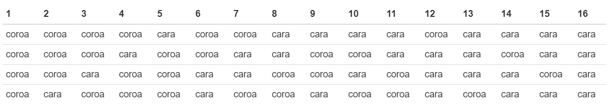
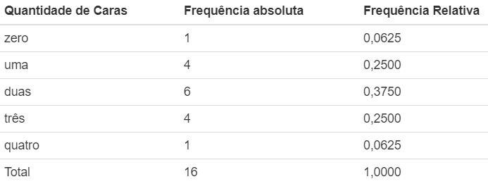

```{r setup, include=FALSE}
library(tufte)
library(xtable)
library(knitr, quietly = TRUE)
opts_chunk$set(
               cache = TRUE,
               tidy = FALSE,
               comment = "#",
               collapse = TRUE,
               fig.align = "center",
               fig.path = "figures/",
               cache.path = "cache/"
           )
```


## Introduçao

O R inclui algumas operações com as distribuições de probabilidade. Pode-se observar que existe 4 operações básicas indicadas pela seguinte letras:

- $d$ \ calcula a densidade de probabilidade $f(x)$ no ponto;

- $p$ \ calcula a função de probabilidade acumulada $F(x)$ no ponto;

- $q$ \ calcula o quantil correspondente a uma dada probabilidade;

- $r$ \ gera uma amostra aleatória da distribuição.


## Distribuição Binomial no R

Seja $X$ o número de sucessos obtidos na realização de $n$ ensaios de Bernoulli independentes. 

Então,

$$P(X=x)={n \choose x}\,p^{x}\,(1-p)^{n-x},\quad \quad x=0,1,\ldots,n$$
**Exemplo 1**


Uma moeda honesta é lançada quatro vezes. Assim, o espaço amostral ($\Omega$) associado a esse experimento aleatório pode ser apresentado pela tabela a seguir

```{r, out.width='200%'}

```  

**Pergunta:**  

Ao lançarmos uma moeda honesta quatro vezes, qual a probabilidade de ocorrer cara  exatamente duas vezes? Ou, qual a probabilidade de ocorrer no máximo três caras nos quatro lançamentos da moeda ? 

Primeiramente, vamos construir uma tabela de frequências com o número de caras X eventos de $\Omega$.

```{r, out.width='75%'}

```  

Observa-s que a tabela de frequências nos informa as respectivas probabilidades. No R, podemos construir o gráfico **Probabilidade x Número de Caras** da seguinte maneira:

```{r, echo=TRUE}
moeda <- data.frame('cara'=
             rep(c('0',"1","2","3","4"), 
                  c(1, 4, 6, 4, 1)))
```

```{r, echo=TRUE}
require(ggplot2)
```

```{r binomial3, echo=TRUE}
ggplot(moeda, aes(x = cara, y=..count../sum(..count..), fill = cara)) +
  geom_bar(width=0.1) +
  labs(title = "Lançamento de uma moeda quatro vezes",
     x = "Número de caras",
     y = "Probabilidade",
     fill='Número de caras')
```
Pode se notar que a medida que a quantidade de lançamentos de uma moeda cresce, **torna-se inviável calcular as probabilidades** diretamente do espaço amostral, por meio de uma tabela de frequências. 
Para resolver esse problema pode-se utilizar o conceito de **variável aleatória**. Neste sentido, vamos estudar **no R**, a variável aleatória que segue **distribuição binomial** e resolver esse e outros problemas por meio desse modelo probabilístico.

1. \ Ocorrer exatamente 2 caras em 4 lançamentos de uma moeda.

```{r, echo=TRUE}
dbinom(x = 2, #Calcula a probabilidade de P(X=x)
       size = 4, #Quantidade total de lançamentos
       prob = 0.5, #Probabilidade inicial de ocorrer o sucesso
       log = FALSE)
```

2. \ Ocorrer no máximo 3 caras em 4 lançamentos de uma moeda.

```{r, echo=TRUE}
pbinom(q = 3, #Quantidade de caras
        size = 4, #Quantidade total de lançamentos
        prob = 0.5, #Probabilidade lançar uma moeda uma única vez e ocorrer cara
        lower.tail = TRUE #P[X <= x]
        )
```

3. \ Podemos utilizar a **função plot** para construir o gráficos de Probabilidades x Valores observados

```{r, echo=TRUE}
caras <- 0:4
probabilidade <- dbinom(x = caras,   # Quantidade de sucessos
                        size = 4,  # Quantidade de lançamentos
                        prob = 0.5)  # Probabilidade de sucesso

probabilidade
```

```{r binomial4, echo=TRUE}
plot(caras, probabilidade, 
     xlab = "Número de Caras",
     ylab = "Probabilidade",
     type ='h',   # Desenha uma linha vertical
     col = 'red',   # Cor da linha
     lwd=3)      # Espessura da linha/ponto
```

**Exemplo 2** 

Suponha que numa linha de produção a probabilidade de se obter uma peça defeituosa é $0,5$. Seleciona-se uma amostra de 10 peças para serem inspecionadas. Suponha que $X$ é o número de peças defeituosa produzidas em único dia. Qual é a probabilidade de um remessa com 10 peças conter pelo menos quatro peças defeituosa?

**Solução**

Observa-se que $X =$ Número de peças defeituosa produzidas numa remessa com 10 peças.

Então, 

$$P[X \geq 4] = 1 - P[X < 4] = 1 - P[X \leq 3]$$

No R, temos que 

```{r, echo=TRUE}
 pbinom(q = 3, #Quantidade de peças defeituosas
        size = 10, #Quantidade total de peças
        prob = 0.5, #Probabilidade de sucesso (peça defeituosa)
        lower.tail = FALSE #P[X > x]
        )


```

## Exercício no R

Considere nascimentos de 4 filhotes de coelhos de uma determinada raça. Nesta raça há um distúrbio genético e a probabilidade de nascer fêmea é 5/8. Sendo $X$ a ocorrência de fêmeas, determine:

a) \ Construa um gráfico de probabilidades x valores observados de $X$

b) \ Qual a probabilidade de nascer pelo menos três fêmeas

