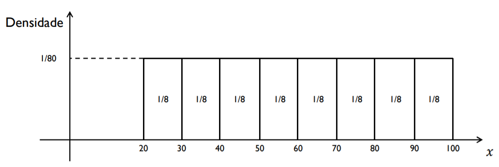
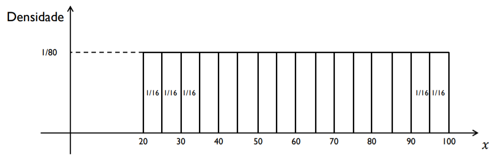
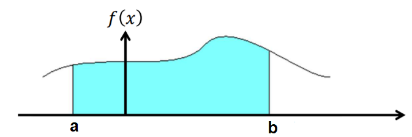

```{r setup, include=FALSE}
library(tufte)
library(xtable)
library(knitr, quietly = TRUE)
opts_chunk$set(
               cache = TRUE,
               tidy = FALSE,
               comment = "#",
               collapse = TRUE,
               fig.align = "center",
               fig.path = "figures/",
               cache.path = "cache/"
           )
```

## Introdução

Uma **variável aleatória** é classificada como **contínua** se **assume valores em
qualquer intervalo dos números reais**, ou seja, um conjunto de valores
não-enumerável. Dessa forma, pode se observar que **não é possível atribuir probabilidades para um ponto específico, apenas para intervalos da reta**.

**Exemplos:**

- Peso de animais;

- Tempo de falha de uma estrutura metálica;

- Resistência à compressão do concreto;

- Altura da maré em uma hora específica;

- Salinidade da água do mar;

- Retorno financeiro de um investimento.


Neste sentido, a natureza dessas variáveis aleatórias nos mostra que não podemos atribuir probabilidades à valores específicos, pois há uma quantidade **não enumerável** (infinita) de valores num intervalo entre dois pontos. Consequentemente, atribui-se probabilidades à intervalos de valores, por meio de uma **função de $X$**. Portanto, **as probabilidades são representadas por áreas** sob a curva.

Graficamente, temos

```{r, out.width='65%'}
knitr::include_graphics("img/densidade1.png")
```

Observa-se que nem todos os $k =11$ intervalos (do histograma) estão sob a curva da função de $X$. Além disso, alguns intervalos não representam a área sob a curva. Porém, aconteceria se dividissémos em $k = 22$ intervalos? Vamos ver por um outro exemplo gráfico.

```{r, out.width='70%'}
knitr::include_graphics("img/densidade2.png")
```

Assim, fazendo-se $k \rightarrow \infty$ (ou $n \rightarrow \infty$), teríamos que cada intervalo represente alguma área (ou probabilidade) sob à curva. 

Vamos avaliar essa ideia com um exemplo prático. 

**Exemplo 1:**

Estudos anteriores revelam a existência de um grande lençol freático (ou de água) no subsolo de uma região. No entanto, sua profundidade ainda não foi determinada, sabendo-se
apenas que o lençol pode estar situado em qualquer ponto entre 20 e 100 metros. Vamos supor que selecionamos, ao acaso, um ponto nessa região e dispomos de uma sonda que, ao fazer a perfuração, detecta a profundidade do reservatório de água. 

Seja $X$ uma variável aleatória contínua tal que 

$$ X: \text{Profundidade do lençol freático}$$ 

A partir disso a ideia é propor um função para $X$ e calcular algumas probabilidades de interesse. 

**Observação 1:** É razoável assumir que a sonda pode parar em qualquer ponto entre 20 e 100 metros, sem que tenhamos motivos para privilegiar essa ou aquela profundidade, ou seja, consideramos todos os pontos como equiprováveis.

**Observação 2:** Ao pensar em atribuir uma probabilidade para cada ponto, chegamos a uma dificuldade, como temos infinitos pontos e todos são equiprováveis, teríamos infinitas probabilidades o que causaria uma probabilidade total de valor infinito, e não 1 como deve ser.

A solução, neste caso, é não considerar valores únicos no cálculo da probabilidade, e sim intervalos de valores. Assim, o espaço amostral correspondente é $[20,100]$ e as profundidades são igualmente prováveis.

Então, 

  - Suponha que dividimos o espaço amostral em 8 intervalos de comprimento 10. 
  
  - É razoável atribuir aos intervalos a probabilidade $\frac{1}{8}$, correspondendo à relação entre o comprimento de cada um deles e o comprimento do espaço amostral.
  
```{r, out.width='85%'}

```  

E se dividissémos o espaço amostral em 16 intervalos ?

```{r, out.width='88%'}

```  

Assim, aumentando cada vez mais o número de intervalos, diminuindo suas amplitudes, até, obtermos (teoricamente) infinitos intervalos e o seguinte histograma

```{r, out.width='90%'}
knitr::include_graphics("img/densidade5.png")
```  

Assim, **a probabilidade** de uma variável aleatória contínua é definida pela área sob à curva de uma **função positiva**, denominada **função densidade de probabilidade**. Observa-se que a função densidade  **não é uma probabilidade**, mas uma função que auxilia na determinação de probabilidades.


Então, para a variável aleatória contínua $X$ representando a profundidade do lençol freático, a função densidade é dada por

$$
f(x) =
  \begin{cases}
  \frac{1}{80} & \quad \text{se } \quad 20 \leq x \leq 100 \\\\
   0  & \quad \text{caso contrário}
  \end{cases}
$$


## Função Densidade 
 

**Definição 1.** 

Diz-se que $X$ é uma variável aleatória contínua, se existir uma função $f$	, denominada função densidade de probabilidade (fdp) de $X$ que satisfaça às seguintes
condições:

i. É uma função não negativa 

$$f(x) \geq 0$$

ii. A área total sob à curva deve ser igual a 1

  $$\int_{-\infty}^{+\infty} f(x) \, dx = 1$$

Vamos considerar uma função densidade $f$ e que nosso interesse é calcular a probabilidade da variável aleatória $X$ observar valores num intervalo $[a,b]$. 


**Pergunta**: Como calcular $P[a \leq X \leq b]$ ? 


Primeiramente, vamos analizar o gráfico da função $f$, ou seja, 

```{r, out.width='80%'}

``` 

Assim, a **funçãfo densidade probabilidade** atribui probabilidades à intervalos de valores do tipo $[a,b]$ e é calculada por

$$	P[a \leq X \leq b] = \int_{a}^{b}f(x)\,dx.$$
**Observações:**

1. \ Seja $a \in X$ um valor observado qualquer. Então, $P[X = a] = 0$, e consequentemente

$$P[a \leq X \leq b] = P[a \leq X < b] = P[a < X \leq b] = P[a < X < b]$$


2. \ Qualquer função $f(\cdot)$ que seja não negativa e cuja área total sob a curva seja igual à unidade caracterizará uma **variável aleatória contínua**.


3. \ A função de distribuição acumulada (fda) para uma variável aleatória $X$ é definida por

$$F(x) = P[X \leq x] = \int_{-\infty}^{x} \,f(t)\,dt,$$
em que $f(t)$ é uma fdp. Isto significa que $F^{\prime}(x) = \frac{dF(x)}{dx} = f(x)$.

**Exemplo 2**

Seja $f$ uma função tal que

$$
f(x)=
\begin{cases}
\frac{3}{2} \, x^2, & \text{se } -1 \leq x \leq 1 \\\\
0,              & \text{caso contrário}
\end{cases}
$$

a) \ Verifique se essa função é uma função densidade.

b) \ Calcule:

    b1. \ $P[X > 0]$
    
    b2. \ $P[X > 1/2]$
    
    b3. \ $P[-1/2 \leq X \leq 1/2]$
    
    b4. \ $P[X < -2]$
    
    b5. \ $P[X < 1/2]$
    
    b6. \ $P[X < 0 \,\, \cup \,\, X > 1/2]$
    
**Solução a. :**    

Para verificar se a função $f$ é densidade probabilidade, precisamos observar duas condições. A primeira é que $f$ seja uma função não-negativa, isto é, $f(x) \geq 0$.


Observa-se que

$$\text{Para} \,\,\, x \in [-1,1] \,\,\, \text{a imagem de f está contida em} \,\, \left[0,\frac{3}{2}\right]$$

Logo, $f(x) \geq 0$.

A segunda condição é que a área sob à curva seja igual a 1, isto é,

$$\int_{-1}^{1}f(x)\,dx = \frac{3}{2}\,\int_{-1}^{1}\,x^2\,dx = \frac{3}{2} \left.\frac{x^3}{3}\right|_{-1}^{1} = 1.$$

Portanto, $f$ é função densidade probabilidade.

**Solução b1. :**

$$P[X > 0] = \int_{0}^{1}f(x)\,dx = \frac{3}{2}\,\int_{0}^{1}\,x^2\,dx = \frac{3}{2} \left.\frac{x^3}{3}\right|_{0}^{1} = \frac{1}{2}.$$


## Valor Esperado e Variância

A esperança de uma variável aleatória contínua $X$ tem o mesmo sentido e interpretação da esperança de uma variável aleatória discreta, ou seja, é a **média** ou **valor esperado** de $X$. Neste caso, a esperança **é obtida por meio da integral do produto de $x$ com a função $f(x)$**, no intervalo definido pelo domínio de $f$.

De uma maneira geral, 

$$\mu = \mbox{E}(X) = \int_{-\infty}^{+\infty}x \cdot f(x)\,dx.$$

A variância de uma variável aleatória $X$, como já vimos, **fornece o grau de dispersão dos valores de uma variável aleatória em relação à sua média** $\mu$. A forma geral para o cálculo é representada por 

$$	\mbox{Var}(X) = \mbox{E}\,\{[X - \mbox{E}(X)]^{2}\} = \mbox{E}\,[(X - \mu)^{2}].$$
No entanto, uma foma mais fácil operacionalmente pode ser deduzida a partir da equação acima, ou seja

$$\mbox{Var}(X)= \mbox{E}(X^{2}) - [\mbox{E}(X)]^{2},$$
em que

$$ \mbox{E}(X^{2}) = \int_{-\infty}^{+\infty}x^{2}\cdot f(x)\,dx.$$
**Exemplo 3**

Seja $X$ uma variável aleatória contínua com função densidade dada por

$$
f(x)=
\begin{cases}
\frac{3}{2} \, x^2, & \text{se } -1 \leq x \leq 1 \\\\
0,              & \text{caso contrário}
\end{cases}
$$


- Determine a $\mbox{E}(X)$, $\mbox{Var}(X)$ e o desvio-padrão $\sigma_{X}$ da variável aleatória $X$.

**Solução:**

A esperança de $X$ é dada por 

$$\mu = \mbox{E}(X) = \int_{-1}^{1}x \cdot f(x)\,dx = \frac{3}{2}\,\int_{-1}^{1}\,x^3\,dx = \frac{3}{2} \left.\frac{x^4}{4}\right|_{-1}^{1} = \frac{3}{2} \left(\frac{1}{4} - \frac{1}{4}\right) = 0.$$


Então, para o cálculo da variância de $X$, temos

$$\mbox{Var}(X) = \mbox{E}(X^2) = \int_{-1}^{1}x^2 \cdot f(x)\,dx = \frac{3}{2}\,\int_{-1}^{1}\,x^4\,dx = \frac{3}{2} \left.\frac{x^5}{5}\right|_{-1}^{1} = \frac{3}{2} \left[\frac{1}{5} - \left(-\frac{1}{5}\right)\right] = \frac{3}{5}.$$

Portanto, o desvio-padrão de $X$ é dado por

$$\sigma_{X} = \sqrt{\mbox{Var}(X)} = \sqrt{\frac{3}{5}} = 0.774$$


## Exercícios

1. \ A duração, em anos, de certa lâmpada especial é uma variável aleatória contínua com densidade dada por
			
$$ f(x) = 2\,\rm{e}^{-2\,x} \quad \text{se} \quad x > 0$$

a) \ Qual é a probabilidade da lâmpada durar até 2 anos ?


b) \ Qual é o valor esperado do tempo de duração (em anos) de uma certa lâmpada ?


2.  \ A variável aleatória contínua $X$ tem função de distribuição acumulada (fda) dada por

$$
F(x)=
\begin{cases}
0, & \text{se} \quad  x < 1 \\\\
\frac{1}{c}(1 - \rm{e}^{-(x-1)}), & \text{se} \quad 1 \leq x < 2 \\\\
\frac{1}{c}(1 -\rm{e}^{-1} + \rm{e}^{2} - \rm{e}^{-2(x-1)}) , & \text{se} \quad x \geq 2 
\end{cases}
$$			


a) \ Obtenha o valor de $c$.


b) \ Obtenha a correspondente função densidade da variável $X$.


c) \ Determine $P(X \geq 3/2 | X < 4)$.
