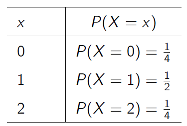
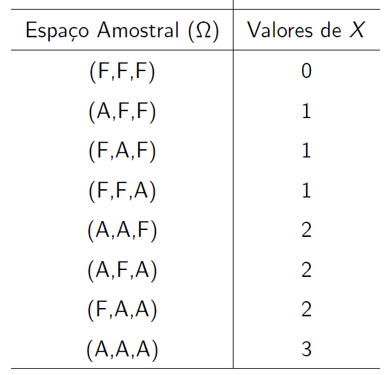
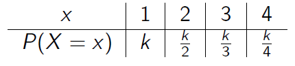
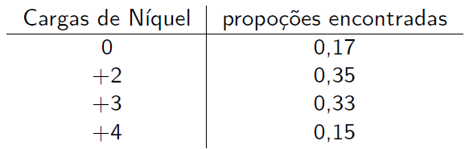

```{r setup, include=FALSE}
library(tufte)
library(xtable)
library(knitr, quietly = TRUE)
opts_chunk$set(
               cache = TRUE,
               tidy = FALSE,
               comment = "#",
               collapse = TRUE,
               fig.align = "center",
               fig.path = "figures/",
               cache.path = "cache/"
           )
```

## Introdução 

Em muitos experimentos é útil trabalhar com uma "variável resumo" do que com a estrutura toda de probabilidade original. Por exemplo, suponha que uma moeda honesta é lançada cinco vezes. Qual é o número de caras? Em geral, esta quantidade é o que tem sido chamada de **variável aleatória**.  Intuitivamente, é uma **variável** pois seus valores variam e, é **aleatória** para enfatizar que o seu resultado é incerto, correto? Não! Do ponto de vista teórico, uma variável aleatória não é nem aleatória e nem uma variável.

**Exemplo 1**

Numa pesquisa de opinião, decidimos perguntar a 50 pessoas se elas concordam ou discordam sobre determinado assunto.

 - 1$^{a}$ Situação: A pessoa concorda $= 1$
 
 - 2$^{a}$ Situação: A pessoa discorda $= 0$
 
Observa-se que o espaço amostral $(\Omega)$ desse experimento contém **$2^{50} = 1125899906842624$** elementos, que são todos os resultados possíveis que podem ocorrer quando as 50 pessoas são consultadas. 

**Pergunta:** Seria interessante reduzir esse espaço para um de tamanho razoável? De que forma?

Vamos definir uma variável e determinar o espaço amostral $\Omega$.

$$X:\mbox{"Número de pessoas que concordam com a afirmação"}.$$

Qual a relação entre $\Omega$ e a variável $X$?


```{r, echo=FALSE, out.width='85%'}
knitr::include_graphics("img/variavel.png")
```

Observe que se contarmos em cada uma dessas $2^{50}$ sequências de tamanho 50 o número de pessoas que concordam, isto é, $X=\{0,1,2,\ldots,50\}$, obtemos um espaço reduzido para esse problema.

Isto significa que **cada elemento do espaço amotral está associado a um único valor dos números reais**, isto é quando definimos uma quantidade $X$, estamos na verdade definindo uma **função do espaço amostral** original em um "novo" espaço amostral, usualmente um **subconjunto dos $\mathbb{R}$**.

## Variável Aleatória

**Definição 1.** Seja um experimento $(\varepsilon)$ associado a um espaço amostral $(\Omega)$. A função $X$ que associa cada elemento do espaço amostral, $\omega \in \Omega$, a um número real, $X(\omega)$, é chamada de **variável aleatória**.
		
Matematicamente, 
		

$$X: \Omega \rightarrow \mathbb{R}$$

No exemplo 1, temos 

$$\Omega = \{\omega_1 = (0,0,\ldots,0), \,\, \omega_2 = (1,0,\ldots,0), \,\, \omega_2 = (0,1,\ldots,0) \,\, , \ldots, \,\, \omega_{50} = (1,1,\ldots,1)\}$$

$$\implies$$ 

$$X(\omega_1) = 0, \,\, X(\omega_2) = 1, \,\, X(\omega_3) = 1 \,\, , \ldots, \,\, X(\omega_{50}) = 50$$

$$\implies$$


$$X = \{0, 1, \ldots, 50\}$$

**Exemplo 2**

Considere dois lançamentos de uma moeda honesta. Seja $X$ o número de "caras" que ocorreu nesses dois lançamentos. Vamos estudar a probabilidade de ocorrência dos valores observado de $X$.

Observa-se que

```{r, echo=FALSE, out.width='50%'}
knitr::include_graphics("img/tab_var.png")
```

Observa-se que $X$ pode assumir os valores $0$, $1$ e $2$, isto é, $$X=\{0,1,2\}$$.

Assumindo-se que os 4 eventos do espaço amostral $\Omega$ tem a mesma probabilidade $\frac{1}{4}$, a probabilidade $P$ em $X$ é dada por

```{r, echo=FALSE, out.width='40%'}

```

## Tipos de Variáveis Aleatórias

**Definição 2.** As variáveis aleatórias que assumem valores num conjunto enumerável (finito ou infinito) são denominadas **discretas** e aquelas que assumem valores num conjunto não-enumerável (intervalo da reta) são denominadas **contínuas**.

**Exemplos:**

- **Variáveis Aleatórias Discretas:**

  - Número de arranhões em uma superfície;

  - Número de plantas doentes numa determinada área;
			
  - Número de arranhões em uma superfície;
				
  - Número de plantas doentes numa determinada área;
				
  - Propoção de partes defeituosas entre 1000 testadas.
			
- **Variáveis Aleatórias Contínuas:**

  - Intensidade de corrente elétrica;
				
  - Tempo de vida de seres humanos;				
				
  - Altura, volume, temperatura, pressão, etc.				
				
				
Assim,

\center Variáveis discretas $\implies$ Assumem valores em um conjunto enumerável (finito ou infinito).
			
\center Variáveis contínuas $\implies$ Assumem valores em um conjunto não-enumerável.

## Variável Aleatória Discreta

**Definição 3.** Seja $X$ uma variável aleatória. Se o número de valores observados de $X$ for finito ou infinito enumerável, denominaremos $X$ de **variável aleatória discreta**.
		
Assim, 

$$X=\{x_{1},x_{2},\ldots,\}; \,\, x_{1} = X(\omega_{1}), \,\, x_{2} = X(\omega_{2}), \,\, \ldots \,\, \text{em que} \,\, \Omega = \{\omega_{1}, \omega_{2}, \ldots,\}.$$


Observa-se que cada possível resultado $x_{i} \in X$ associa-se a uma função $P(\cdot)$ tal que 

$$p(x_{i}) = P(X = x_{i}),\,\,\mbox{para todo}\,\, i = 1,\ldots,n $$

denominada de **função (massa) de probabilidade** (fp) de $X$. Note que uma função é de probabilidade se satisfaz as seguintes condições:

1. \ $P(X = x_{i}) \geq 0$;

2. \ $\displaystyle\sum_{i=1}^{n} P(X = x_{i}) = 1.$

### Exercícios

1) \ Em um processo de fabricação de semicondutores, três pastilhas de um lote são testadas. Cada pastilha é classificada como "aprovada" ou "falha". Suponha que a probabilidade de uma pastilha ser aprovada no teste é $0,8$ e que as pastilhas sejam independentes. Seja a variável resposta $X$ o número de pastilhas de um lote que são aprovdas no teste. Determine a função de probabilidade de $X$.

**Solução**

$$X: \text{Número de pastilhas de um lote que são aprovadas no teste}$$

Vamos definir os eventos: 

$$A: \text{Pastilha é aprovada no teste} \implies P(A) = 0,8$$

$$F: \text{Pastilha falha no teste} \implies P(F) = 0,2$$

Vamos estudar os valores observados de $X$ e relacioná-los com os eventos do espaço amostral. 

Assim, temos

```{r, echo=FALSE, out.width='50%'}

```

Observa-se que $X = \{0, 1, 2, 3\}$. Como os eventos $A$ e $F$ não são equiprováveis, então as probabilidades dos respectivos eventos do espaço amostral não é $\frac{1}{8}$. 

Logo, para determinar a função de probabilidade de $X$ basta calcular as probabilidades para cada valor observado. 

Então,

$$P(X = 0) = P[(F,F,F)] = P(F \,\, \cap \,\, F \, \cap \,\, F) = P(F)\cdot P(F)\cdot P(F) = (0.2)^3 = 0.008\quad\quad\quad\quad\quad\quad$$ 

\ 

$$P(X = 1) = P[(A,F,F) \, \cap \, (F,A,F) \, \cap \, (F,F,A)]  = 3 \,\, P(A)\cdot P(F)\cdot P(F) = 3\cdot(0.8)\cdot(0.2)^2 = 0.096$$

\ 

$$P(X = 2) = P[(A,A,F) \, \cap \, (A,F,A) \, \cap \, (F,A,A)]  = 3 \,\, P(A)\cdot P(A)\cdot P(F) = 3\cdot(0.8)^2\cdot(0.2) = 0.384$$

\

$$P(X = 3) = P[(A,A,A)] = P(A \,\, \cap \,\, A \, \cap \,\, A) = P(A)\cdot P(A)\cdot P(A) = (0.8)^3 = 0.512\quad\quad\quad\quad\quad\quad$$ 

Portanto, a função (ou distribuição) de probabilidade de $X$ é dada por

```{r, echo=FALSE, out.width='55%'}
knitr::include_graphics("img/fp.png")
```

O esboço do gráfico da função de probabilidade de $X$ é representado por

```{r VAD}
pastilhas = seq(0,3,1)
prob_suc = 0.8
npassa = data.frame(Pr = dbinom(pastilhas, 3, prob_suc))
rownames(npassa) = 0:3
cbind(npassa)
plot(pastilhas, dbinom(pastilhas, size=3, prob=prob_suc),
xlab="Número de Pastilhas que são Aprovadas no Teste", ylab="Probabilidades",
main='', axes=F, type="h", col='blue')
points(pastilhas, dbinom(pastilhas, size=3, prob=prob_suc),
pch=16, , col='blue')
axis(1, pastilhas)
axis(2, seq(0, 0.45, .05), las=1)
abline(h=0, col="gray", cex=2.5, lwd=2)
box(bty='l')
```

2) \ O número de carros vendidos semanalmente num stand é uma variável aleatória $X$ com as seguintes probabilidades:

```{r, echo=FALSE, out.width='40%'}

```

a) \ Calcule o valor de $k$ para que $P(X = x)$ seja uma função de probabilidade.

b) \ Determine a função de probabilidade de $X$ e esboce seu gráfico.

c) \ Calcule a probabilidade do número de carros vendidos não chegar a 4, sabendo-se que este  valor é superior a 1.

3) \ Suponha que uma produção diária de 850 peças fabricadas contenha 50 que não obedecem aos requerimentos do consumidor. Duas peças são selecionadas ao acaso, sem reposição, do lote. Seja $X$ a variável aleatória que representa o número de peças não-conformes na amostra. Esboce o gráfico da função de probabilidade de $X$?

## Função de Distribuição Acumulada

No exercício 1 estavamos interessados em encontrar a distribuição de probabilidades da variável aleatória $X$ (número de pastilhas de um lote que é aprovada no teste).
Algumas vezes, podemos estar interessados em avaliar se **no máximo duas pastilhas foram aprovadas (ou falharam) no teste**. Isto significa calcular a probabilidade 
		
$$P(X \leq 2) = P(X = 0) + P(X = 1) + P(X = 2) = 0,488$$
			
		
**Observação.** Algumas vezes é útil descrever a distribuição de probabilidades de uma variável aleatória por meio de **probabilidades cumulativas**, isto é, $P(X \leq x)$.
			
Em geral, para qualquer variável aleatória com valores observados $x_{1}, x_{2}, \ldots, x_{n}$, pode-se notar que os eventos $[X=x_{1}], [X=x_{2}], \ldots,  [X=x_{n}]$ são **mutuamente exclusivos**.


**Definição 4.** A função de distribuição acumulada (fda) de uma variável aleatória $X$, denotada por $F(x)$, é definida por 
		
$$F(x) = P(X \leq x) = \sum_{x_{i} \, \leq \, x} P(X = x_{i})$$

**Propriedades:**
			
P1. \ $0\leq F(x) \leq 1$

P2. \ Se \ $x \leq y$ \ então \ $F(x) \leq F(y)$	\ (função não-decrescente)	

**Exemplo**

Uma população de 1000 crianças foi analisada num estudo para determinar a efetividade de uma vacina contra um tipo de alergia. No estudo, as crianças recebiam uma dose da vacina e, após um mês, passavam por um novo teste. Caso ainda tivessem tido alguma reação alérgica, recebiam outra dose da vacina. Ao fim de 5 doses todas as crianças foram consideradas imunizadas. Os resultados estão na tabela a seguir.

```{r, out.width='45%'}
knitr::include_graphics("img/freq.png")
```

Para uma criança selecionada ao acaso qual a probabilidade dela ter recebido 2
doses? E até 2 doses? Determine a função de distribuição acumulada do número de doses da vacina por um novo teste.

**Solução**

Seja $X$ uma variável aleatória que representa o número de doses de uma vacina. 
Então, a tabela de frequências e o gráfico das frequências acumuladas para $X$ são dados por

```{r, out.width='120%'}
knitr::include_graphics("img/exemplo2.png")
```

Assim,

$$
F(2) = P(X \leq 2) = P(X = 1) + P(X = 2) = 0,533.
$$

Observa-se que podemos escrever

$$
F(x) = P(X \leq x) = 0,533 \quad \text{para} \quad 2 \leq x < 3.
$$

Assim, a função de distribuição de $X$ é representada por
\small
\[F(x) = \left\{
  \begin{array}{lr}
    0 & \text{se } x < 1 \\
    0,245 & \text{se } 1 \leq x < 2 \\
    0,533 & \text{se } 2 \leq x < 3 \\
    0,789 & \text{se } 3 \leq x < 4 \\
    0,934 & \text{se } 4 \leq x < 5 \\
    1 & \text{se } x \geq 5
  \end{array}
\right.
\]

### Exercício

Esboce o gráfico da função de distribuição acumulada do ex. 3 

## Valor Esperado

O **valor esperado**, ou **média**, ou **esperança matemática** é uma
quantidade utilizada como resumo do comportamento de uma variável aleatória. 
O valor esperado de uma vaeiável aleatória discreta $X$, denotada por $\text{E}(X)$, é obtida multiplicando-se cada valor observado $x_i$ por sua respectiva probabilidade $P[X = x_i]$, e somando os produtos resultantes, isto é

$$\text{E}(X) = \sum_{i} x_{i}\cdot P(X=x_{i})$$
Observa-se que a esperança é o valor médio que **esperaríamos** se o experimento aleatório continuasse sendo repetido muitas vezes.

**Exemplo:** Determine o valor esperado do número de solicitações de empréstimos aprovados por semana (X)

```{r, out.width='30%'}
knitr::include_graphics("img/exvaloresp.png")
```

## Variância 

A variância de uma variável aleatória $X$, representa **o grau de dispersão dos valores de uma variável aleatória em relação à sua média**  $\mbox{E}(X)$, isto é,

$$\mbox{Var}(X) = \mbox{E}\left\{\left[X - \mbox{E}(X)\right]^{2}\right\}.$$

No entanto, uma foma mais fácil operacionalmente pode ser deduzida a partir da equação acima, e assim, temos

$$\mbox{Var}(X) = \mbox{E}(X^{2}) - \left[\mbox{E}(X)\right]^{2},$$
em que 

$$\mbox{E}(X^2) = \sum_{i} x^{2}_{i}\cdot P(X=x_{i}).$$
Assim, o desvio-padrão de uma variável aleatória $X$ é $\text{DP}(X) = \sqrt{\text{Var}(X)}$.

**Observações:**

- Observa-se que a esperança $\mbox{E}(X)$ e a variância $\mbox{Var}(X)$ tem importância na caracterização de diversas distribuições de probabilidade.

- Quando se conhece a **esperança** e a **variância** de um modelo de probabilidade, ele fica totalmente caracterizado, ou seja, sabemos seu formato geral.

- Voltando ao exemplo anterior, calcule a variância e o desvio-padrão para o número de solicitações de empréstimos aprovados por semana ($X$).

## Propriedades
	
Seja $X$ uma variável aleatória discreta  e  $a, \, b , \, c \, \in \mathbb{R}$ constantes.

P1. \ $\mbox{E}(c) = c$

P2. \ $\mbox{E}(c\,X) = c\,\mbox{E}(X)$

P3. \ $\mbox{E}(a\,X + b) = a\,\mbox{E}(X) + b$

P4. \ Sejam $X$ e $Y$ variáveis aleatórias quaisquer. Então, $\mbox{E}(X + Y) = \mbox{E}(X) + \mbox{E}(Y)$

A **variância** de uma variável aleatória discreta $X$ possui as seguintes propriedades:

P1. \ $\mbox{Var}(0) = 0$

P2. \ $\mbox{Var}(a\,X) = a^{2}\,\mbox{Var}(X)$

P3. \ $\mbox{Var}(a) = 0$

P4. \ Se $X$ e $Y$ são independentes então $ \mbox{Var}(X + Y) = \mbox{Var}(X) + \mbox{Var}(Y)$

## Exercícios

1. \  O número de mensagens enviadas por hora, através de uma rede de computadores, tem a seguinte distribuição:

```{r, out.width='75%'}
knitr::include_graphics("img/exemplo4.png")
```
Qual é o valor esperado e o desvio padrão do número de mensagens enviadas por hora?

2. \ A tabela abaixo apresenta as estimativas de retorno para dois investimentos (A e B), em R\$ 1.000,00, sob três condições econômicas com diferentes probabilidades.

```{r, out.width='75%'}
knitr::include_graphics("img/exemplo3.png")
```

a) \ Calcule a esperança para cada um dos investimentos, para verificar qual investimento maximiza o lucro.

b) \ Calcule o desvio-padrão para cada um dos investimentos, para verificar qual investimento minimiza o risco.

3. \ Em uma bateria NiCd, uma célula completamente carregada é composta de hidróxido de níquel III. Níquel é um elemento químico que tem múltiplos estados de oxidação. Considere as seguintes proporções dos estados:

```{r, out.width='55%'}

```

a) \ Determine a função de distribuição acumulada de níquel e esboçe seu gráfico.

b) \  Determine o valor médio e a variância da carga de níquel.

4. \ Considere o seguinte jogo. Um indivíduo aposta em um dos números de 1 a 6. Três dados honestos são então lançados, de maneira independente, e, se o número apostado aparecer $i$ vezes, $i = 1, 2, 3$; o apostador ganha $i$ reais; caso o número apostado não apareça em nenhum dos dados, o apostador perde 1 real. Seja X a variável aleatória que representa o ganho do apostador no jogo. Determine:

a) \ Os valores observados de X.
b) \ A função de probabilidade de X.
c) \ A função de distribuição acumulada de X e esboce o seu gráfico. 
d) \ O ganho esperado do apostador.
e) \ Com base no item (d), o jogo trará lucro ou prejuízo para o apostador.